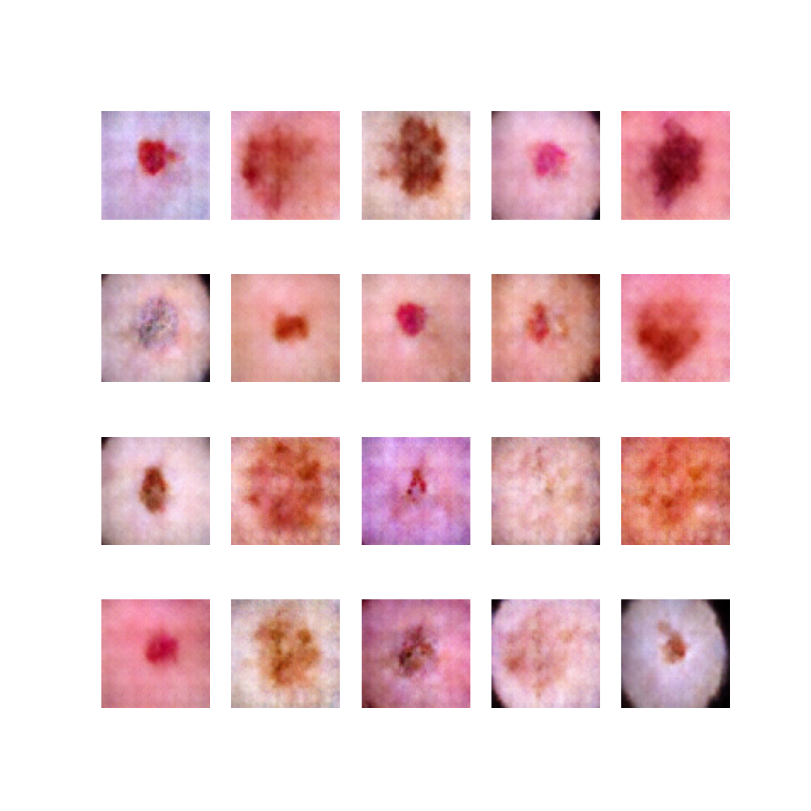

# Fake Image Generator - Generative Adversarial Network for Custom Dataset: Generative Models

## Overview

FakeImageGenerator (GAN-based Project for Synthesizing Grayscale images) is a machine learning project focused on generating synthetic images using Generative Adversarial Networks (GANs). Specifically, it is designed to work with the Custom dataset, a large database of handwritten digits commonly used for training various image processing systems.

## Features

- Utilizes PyTorch for implementing GAN models.
- Provides scripts for easy training and generating synthetic images.
- Command Line Interface for easy interaction.
- Includes a custom data loader for the Custom dataset.
- Customizable training parameters for experimenting with GAN.

## Installation

Clone the repository:

```
git clone https://github.com/atikul-islam-sajib/FakeImageGenerate.git

cd FakeImageGenerate
```

# Install dependencies

```
pip install -r requirements.txt
```

## Usage

Examples of commands and their explanations.

```bash
python /path/to/FakeImageGenerate/src/cli.py --help
```

### Options

- `--batch_size BATCH_SIZE`: Set the batch size for the dataloader. (Default: specify if there's one)
- `--image_path`: Define the dataset path.
- `--epochs EPOCHS`: Set the number of training epochs.
- `--latent_space LATENT_SPACE`: Define the size of the latent space for the model.
- `--lr LR`: Specify the learning rate for training the model.
- `--num_samples SAMPLES`: Determine the number of samples to generate after training.
- `--test`: Run tests with synthetic data to validate model performance.
- `--device`: Train the model with CPU, GPU, MPS.
- `--display`: Display the critic loss and generator loss in each iterations[True/False]

## Training and Generating Images(CLI)

### Training the GAN Model

To train the GAN model with default parameters with mps:

```
!python /content/FakeImageGenerate/src/cli.py  --epochs 200 --latent_space 100 --image_size 64  --lr 0.00005 --device mps --batch_size 64 --image_path /image.zip/ --display True
```

To train the GAN model with default parameters with gpu:

```
!python /content/FakeImageGenerate/src/cli.py  --epochs 200 --latent_space 100 --image_size 64  --lr 0.00005 --device gpu --batch_size 64 --critic_steps 5 --image_path /image.zip --display True
```

To train the GAN model with default parameters with cpu:

```
!python /content/FakeImageGenerate/src/cli.py  --epochs 200 --latent_space 100 --image_size 64 --lr 0.00005 --device cpu --batch_size 64 --image_path /image.zip --display True
```

### Generating Images

To generate images using the trained model:

```
!python /content/FakeImageGenerate/src/cli.py --num_samples 20 --latent_space 100 --test
```

### Viewing Generated Images

Check the specified output directory for the generated images.

```
from IPython.display import Image
Image(filename='/content/FakeImageGenerate/outputs/fake_image.png')
```

## Core Script Usage

The core script sets up the necessary components for training the GAN. Here's a quick overview of what each part does:

```python
from src.dataloader import Loader
from src.generator import Generator
from src.discriminator import Discriminator
from src.trainer import Trainer
from src.test import Test

# Initialize the data loader with batch size
loader = Loader(
    image_path = "/content/drive/MyDrive/anime.zip",
    batch_size = 128,
    image_height = 64,
    image_width = 64,
    normalized = True)

    dataloader = loader.extract_features()
    loader.create_dataloader()

#================================================================================================================#

# Set up the trainer with learning rate, epochs, and latent space size
trainer = Trainer( device = "cuda", latent_space = 100, image_size = 64, lr = 0.0002, epochs = 20, display = True)
trainer.train()

#================================================================================================================#

# Test the generated dataset and display the synthetic images
test = Test( latent_space=100, num_samples =20, device="cuda")
test.test()

#================================================================================================================#

from IPython.display import Image
Image("/content/FakeImageGenerate/outputs/fake_image.png")
```

This script initializes the data loader, downloads the Custom dataset, and prepares the data loader. It then sets up and starts the training process for the GAN model.

## Documentation

For detailed documentation on the implementation and usage, visit the [FakeImageGenerator Documentation](https://atikul-islam-sajib.github.io/FIG-deploy/).

## Notebook Training

For detailed documentation on the implementation and usage using notebook, visit the [Notebook for CLI](./notebooks/ModelTrain_CLI.ipynb).

For detailed documentation on the implementation and usage using notebook, visit the [Notebook for Import Modules](./notebooks/ModelTrain_Import_Modules.ipynb).

## Contributing

Contributions to improve the project are welcome. Please follow the standard procedures for contributing to open-source projects.

## License

This project is licensed under [MIT LICENSE](./LICENSE). Please see the LICENSE file for more details.

## Acknowledgements

Thanks to all contributors and users of the GPWGAN project. Special thanks to those who have provided feedback and suggestions for improvements.

## Contact

For any inquiries or suggestions, feel free to reach out to [atikulislamsajib137@gmail.com].
